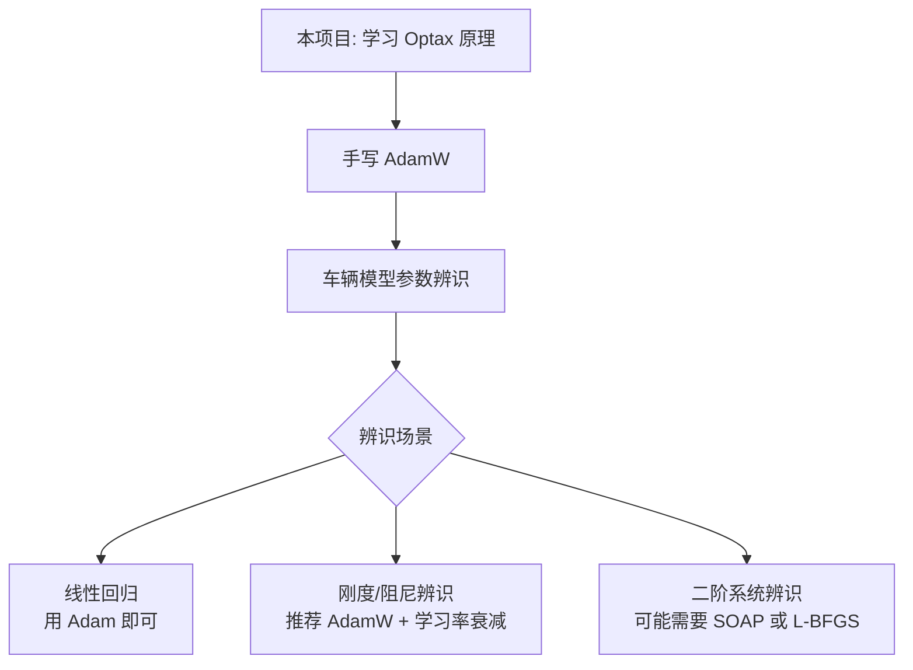

# Optax 算法实现细节学习设计

> 对应计划: `doc/plan/20260829_学习Optax针对jax模型参数优化的算法实现细节.md`
>
> 作者: shucheng.zhao
>
> 日期: 2026-08-29

---

## 0. 重要补充：基于 Optax 0.2.8 源码的关键发现（必读）

实际查看本地 Optax 源码后，原设计有几处需要修正/补充：

### 0.1 协议已升级：`GradientTransformationExtraArgs`

> 源码: `_src/base.py:198`
>
> 官方推荐: "Prefer `:class:`GradientTransformationExtraArgs` for new optimizers."

- 旧版 `update(updates, state, params=None)`
- 新版 `update(updates, state, params=None, **extra_args)`，可接收额外 kw 参数（如 `loss`、`value`）
- **`chain`、`inject_hyperparams` 返回的都是 `GradientTransformationExtraArgs`**

**调整建议**: 手写阶段实现 `GradientTransformationExtraArgs`，而不是旧的 `GradientTransformation`。

### 0.2 官方 `optax.adam` 实际是 `chain(scale_by_adam, scale_by_learning_rate)`

> 源码: `_src/alias.py:519`

```python
return combine.chain(
    transform.scale_by_adam(b1=b1, b2=b2, eps=eps, ...),
    transform.scale_by_learning_rate(learning_rate),
)
```

**这是一个巨大的认知更新**:
- Adam 不是「一个原子优化器」，而是「方向变换」+「步长变换」的组合
- `scale_by_adam` 只负责计算更新方向 $m / \sqrt{v}$（不乘学习率）
- `scale_by_learning_rate` 单独负责施加 $-\alpha_t$
- 这种解耦使得学习率调度、超参数注入变得非常灵活

**调整建议**: 学习 Adam 时，必须分两层理解（方向 + 步长），不能糊在一起看。

### 0.3 AdamW 的 weight_decay 与学习率相乘（与 PyTorch 一致，与论文不同）

> 源码: `_src/alias.py:598` docstring

官方 AdamW 公式:

$$u_t \leftarrow -\alpha_t \cdot \left( \frac{\hat{m}_t}{\sqrt{\hat{v}_t + \bar{\varepsilon}} + \varepsilon} + \lambda \theta_t \right)$$

- $\lambda \theta_t$ 中的 $\lambda$ 在乘进 $-\alpha_t$ 后，最终等效 $\alpha_t \cdot \lambda$ 一起作用于 $\theta_t$
- 与 Loshchilov 原始论文不一致，与 PyTorch 一致
- 文档明确警告这一点

**调整建议**: 数学笔记里要注明「optax 实现 vs 论文实现」的差异，否则手写版与官方版会有量级偏差。

### 0.4 状态用 NamedTuple，不用可变容器

> 源码: `_src/transform.py:238`

```python
class ScaleByAdamState(NamedTuple):
  count: jax.typing.ArrayLike  # shape=(), dtype=jnp.int32.
  mu: base.Updates
  nu: base.Updates
```

- 状态必须是 immutable 的 pytree（NamedTuple、dict、list 都行）
- `count` 必须是 `dtype=jnp.int32`，且用 `numerics.safe_increment` 递增（避免溢出 + jax 静态追踪友好）

### 0.5 `optax.tree` 是常用工具集

> 源码: `optax/tree/__init__.py`

手写优化器时强烈推荐使用:

| 工具 | 作用 |
|---|---|
| `optax.tree.zeros_like(params)` | 用 0 初始化与 params 同结构的状态 |
| `optax.tree.full_like(params, value)` | 用 value 初始化 |
| `optax.tree.update_moment(updates, state, decay, order)` | 计算 $b \cdot s + (1-b) \cdot u^{\text{order}}$ |
| `optax.tree.update_moment_per_elem_norm(updates, state, decay, order)` | 同上但对每元素先求 norm |
| `optax.tree.bias_correction(m, decay, count)` | 计算 $m / (1 - decay^{count})$ |
| `optax.tree.cast_like(nu, target)` | 转换 dtype |

**调整建议**: 手写阶段可以直接 `from optax import tree` 复用这些工具，再手写 `init_fn` 和 `update_fn` 的胶水代码。

### 0.6 新增 `eps_root` 参数（meta-grad 通过 Adam 时需要）

> 源码: `_src/transform.py:263`

Adam 默认 `eps_root=0.0`，若设为非零小量，可以在 sqrt 内加稳定项 — 目的是支持**对优化器内部状态求梯度**（meta-learning 场景）。

普通参数辨识不涉及 meta-grad，使用默认值即可。

### 0.7 推荐的优化器清单（更新版）

基于 `_src/alias.py` 中实际实现的优化器:

| 优化器 | 必学 | 备注 |
|---|---|---|
| SGD | ✓ | 最基础 |
| SGD with Momentum | ✓ | 引入动量 |
| AdaGrad | ✓ | 自适应学习率起点 |
| RMSProp | ✓ | 解决 AdaGrad 学习率消失 |
| Adam | ✓ | 工程首选 |
| AdamW | ✓ | **车辆模型辨识很可能用到** |
| Adamax | 可选 | 用 $\ell_\infty$ 范数代替 $\ell_2$ |
| Lion | ✓ | 新方法，状态更小（只用一阶动量），值得了解 |
| AMSGrad | 可选 | Adam 的收敛性修正 |
| L-BFGS | 可选 | 二阶方法，参数辨识偶尔用到 |
| SOAP | 可选 | 2024 新方法，Shampoo + Adam |
| Adafactor | 可选 | 节省显存的大模型优化器 |

**新增必学项**: **Lion**（只用一阶动量、内存更省、车辆模型参数维度小时性能不错）

---

## 1. 学习目标再细化

原计划目标偏抽象，落地前需要拆成可验证的子目标：

| 目标层级 | 关键问题 | 验证方式 |
|---|---|---|
| L1 用法层 | Optax 的 API 怎么调用？ | 能独立写出一个 train loop |
| L2 组合层 | `optax.chain` / `inject_hyperparams` 怎么组装？ | 能写出多策略组合的自定义优化器 |
| L3 数学层 | Adam/RMSProp/AdaGrad 的数学公式是什么？为什么这样设计？ | 能手写出更新公式 |
| L4 实现层 | Optax 内部是怎么用纯函数实现的？`GradientTransformation` 协议是什么？ | 能不参考源码独立手写 SGD/Adam |
| L5 验证层 | 手写实现与 Optax 官方实现的数值一致性如何？ | 通过 `assert_allclose` 等精度验证 |

**建议**: 学习结束后，能达到 L4 + L5 即可视为掌握，再回看 vehicle_vertical_plant_model 的项目代码应该毫无压力。

---

## 2. 学习路径（推荐四阶段）


### 阶段 1 — 用法熟悉（已完成 ✓）
文件: `learn/01_fitting_a_linear_model.py`、`learn/02_fitting_a_MLP.py`

- 已覆盖: `optax.adam`、`optax.chain`、`clip_by_global_norm`、`scale_by_adam`、`scale_by_schedule`、`inject_hyperparams`、`l2_loss`、`sigmoid_binary_cross_entropy`
- 评估: 阶段 1 目标达成，可以进入下一阶段

### 阶段 2 — 数学原理梳理（新增任务）

为每个常用优化器写一份「数学笔记」，纯文本/Markdown 形式即可，包含：

1. **算法动机**：要解决什么问题？（如 Adam 解决 SGD+Momentum 在稀疏梯度下的步长不稳定）
2. **更新公式**：写清楚 $g_t$、$m_t$、$v_t$、$\hat{m}_t$、$\hat{v}_t$、$\theta_{t+1}$
3. **超参数意义**：$\beta_1$、$\beta_2$、$\epsilon$ 各自影响什么
4. **适用场景**：什么数据/问题适合这个优化器
5. **⚠️ 实现差异标注**：optax 的实现与原始论文有何不同（特别是 AdamW 的 weight_decay 处理）

**建议覆盖的优化器清单**（按优先级）已更新至 §0.7。

输出文件建议: `learn/notes/<optimizer>_math.md`

### 阶段 3 — 源码级手写实现（核心任务）

**目标**: 不参考 Optax 源码，从零手写 SGD、Adam、AdamW、Lion 四个优化器。

文件命名建议: `learn/03_handwritten_sgd.py`、`learn/04_handwritten_adam.py`、`learn/05_handwritten_adamw.py`、`learn/05b_handwritten_lion.py`

每个文件需要实现：
- 纯函数风格（与 Optax 一致）
- 返回 `base.GradientTransformationExtraArgs(init_fn, update_fn)`（不是旧协议）
- `update_fn(updates, state, params=None, **extra_args)` — 必须接受 `**extra_args` 关键字
- 状态用 **`NamedTuple`**（与 Optax 完全一致），不是可变 dict
- 状态字段都必须是 pytree（leaf 是 `jnp.ndarray` 或 `int32` 标量）

**推荐手写顺序**:
1. **SGD**（最简单，5 行内）— 重点理解「为什么 update 返回的不是 `params - lr*grad`，而是 `-lr*grad`」
2. **SGD with Momentum**（加入动量状态 + 用 `optax.tree.update_moment` 或手写）
3. **Adam** — 必须先实现为 `chain(scale_by_adam, scale_by_learning_rate)` 两段，与官方保持一致
4. **AdamW** — 在 Adam 基础上加 `additive_weight_decay` 变换
5. **Lion**（加分项）— 用 `jnp.sign` 而不是缩放，状态只有一阶动量

**关键实现要点**（基于源码整理，避免踩坑）:

```python
# SGD 最小实现模板
from typing import NamedTuple
import jax.numpy as jnp
import jax
from optax._src import base

class SGDState(NamedTuple):
    pass  # SGD 无状态

def my_sgd(learning_rate: float) -> base.GradientTransformationExtraArgs:
    def init_fn(params):
        return SGDState()
    def update_fn(updates, state, params=None, **extra_args):
        # 关键: 返回的是 -lr * grad，不是 params - lr * grad
        new_updates = jax.tree.map(lambda g: -learning_rate * g, updates)
        return new_updates, state
    return base.GradientTransformationExtraArgs(init_fn, update_fn)
```

```python
# Adam 最小实现模板（与官方结构对齐）
class ScaleByAdamState(NamedTuple):
    count: jnp.ndarray  # int32, shape=()
    mu: base.Updates
    nu: base.Updates

def scale_by_adam(b1=0.9, b2=0.999, eps=1e-8) -> base.GradientTransformation:
    def init_fn(params):
        return ScaleByAdamState(
            count=jnp.zeros([], jnp.int32),
            mu=jax.tree.map(jnp.zeros_like, params),
            nu=jax.tree.map(jnp.zeros_like, params),
        )
    def update_fn(updates, state, params=None, **extra_args):
        count_inc = state.count + 1  # 或用 numerics.safe_increment
        mu = jax.tree.map(lambda m, g: b1*m + (1-b1)*g, state.mu, updates)
        nu = jax.tree.map(lambda v, g: b2*v + (1-b2)*g**2, state.nu, updates)
        # 偏差修正
        bc1 = 1 - b1**count_inc
        bc2 = 1 - b2**count_inc
        new_updates = jax.tree.map(
            lambda m, v, g: -m/bc1 / (jnp.sqrt(v/bc2) + eps),
            mu, nu, updates,
        )
        return new_updates, ScaleByAdamState(count=count_inc, mu=mu, nu=nu)
    return base.GradientTransformation(init_fn, update_fn)
```

**避坑清单**:
- ❌ 不要让 `update` 返回 `params - lr * grad`（应该返回更新量本身）
- ❌ 不要用 mutable state（如 `state['count'] += 1`）— 用 NamedTuple 重建
- ❌ 不要忘记 bias correction（Adam 的 $m_t / (1-\beta_1^t)$ 项）
- ❌ count 必须是 `jnp.int32`，不能是 Python `int`（否则 jit 失败）
- ✅ 可以复用 `optax.tree` 工具（`update_moment`、`bias_correction`、`full_like`）来减少手写代码量
- ✅ `apply_updates` 实际就是 `jax.tree.map(lambda p, u: p + u, ...)`，可以自己实现

### 阶段 4 — 数值一致性验证（核心任务）

文件: `learn/06_verify_against_optax.py`

**目的**: 在同一个 toy 任务上，比较手写 Adam 和 `optax.adam` 的最终参数与每一步轨迹。

**实现要求**:
1. **必须 `jit` 训练循环** — Optax 设计本身就是为了 jit，手写版本不 jit 会有数值抖动
2. **随机种子固定** — 双方用相同 `PRNGKey`
3. **每步对比**: `params_after_step_i`、`opt_state_after_step_i`、累积梯度
4. **最终断言**: `assert_allclose(my_params, optax_params, atol=1e-6)`

```python
# 伪代码思路（伪代码示意）
import optax
from optax._src import base
import jax
import jax.numpy as jnp

# 准备相同的初始 params、初始 state、初始 grads
my_tx = chain(my_scale_by_adam(), my_scale(-0.001))
optax_tx = optax.adam(0.001)

# 双方各自跑 N 步
for step in range(N):
    grads = compute_grads(params)
    my_updates, my_state = my_tx.update(grads, my_state, params)
    optax_updates, optax_state = optax_tx.update(grads, optax_state, params)
    # 关键: assert_allclose 两边的 updates
    assert_allclose(my_updates, optax_updates, atol=1e-6)
    params = optax.apply_updates(params, my_updates)
    optax_params = optax.apply_updates(optax_params, optax_updates)
```

**容差选择**: 浮点累加误差通常在 $10^{-6} \sim 10^{-7}$ 量级，超过则说明实现有 bug。

**常见失败原因清单**:
- 偏差修正项算错（漏了 $1-\beta^t$）
- count 起点错（从 0 开始还是 1 开始 — Optax 用 0，bias_correction 用 `count+1`）
- AdamW 中 `weight_decay` 的位置错（应该加在 update 上，而不是加在 loss 上）
- 状态 dtype 不一致（jnp.int32 vs Python int）

---

## 3. 实践任务清单（线性 + 非线性）

原计划已指定两个例子，建议结构如下：

### 3.1 线性模型参数优化

文件: `learn/03_linear_model_handwritten.py`

- **目标函数**: $y = w_1 x_1 + w_2 x_2$，参数 2 维
- **数据生成**: 已知真值 $w^* = [0.5, 0.5]$，加高斯噪声
- **训练方式**: 全量梯度下降（小数据不必 mini-batch）
- **可视化**: 用 mermaid 流程图 + 训练曲线（可选 matplotlib）
- **预期产出**:
  - 手写 SGD 与手写 Adam 对比收敛速度
  - 学习率敏感性分析（$10^{-1}$ 到 $10^{-4}$）

### 3.2 非线性模型参数优化

文件: `learn/04_nonlinear_model_handwritten.py`

- **目标函数（推荐）**: 选与车辆模型相关的非线性结构，便于迁移
  - 方案 A: 一阶 RC 模型 $y(t) = K(1 - e^{-t/\tau})$，辨识 $K$ 和 $\tau$
  - 方案 B: 二次多项式 $y = a x^2 + b x + c$，易画图
  - 方案 C: 弹簧阻尼系统参数辨识（最贴近真实项目，但实现稍重）
- **推荐**: 方案 A（结构简单、有物理意义、便于验证）
- **非线性来源**: $e^{-t/\tau}$ 项
- **训练方式**: Adam + 学习率衰减
- **可视化**: mermaid 数据流图 + 拟合曲线
- **预期产出**:
  - 验证 Adam 在非线性问题上的优势（对比 SGD）
  - 观察学习率调度对收敛的影响

---

## 4. 与 vehicle_vertical_plant_model 的衔接

完成本学习后，回到原项目时建议关注以下衔接点：



**重点提醒**:
- 车辆模型的 loss landscape 通常有多个局部极小值，建议学习 `inject_hyperparams` 调度学习率
- 物理参数辨识常需要约束（如 $K > 0$、$\zeta \in [0, 1]$），可以学习 `optax.constrain` 或参数投影
- 如果使用 7 自由度整车模型，参数维度较高（~30+），AdamW 通常比裸 Adam 更稳定

---

## 5. 学习里程碑与时间预估

| 里程碑 | 产出物 | 预估 |
|---|---|---|
| M1 数学笔记 | `learn/notes/*.md`（6 份） | 1 天 |
| M2 手写 SGD | `learn/03_handwritten_sgd.py` + 验证 | 0.5 天 |
| M3 手写 Adam | `learn/04_handwritten_adam.py` + 验证 | 1 天 |
| M4 手写 AdamW | `learn/05_handwritten_adamw.py` + 验证 | 0.5 天 |
| M5 数值一致性 | `learn/06_verify_against_optax.py` | 0.5 天 |
| M6 线性案例 | `learn/07_linear_case.py` | 0.5 天 |
| M7 非线性案例 | `learn/08_nonlinear_case.py` | 1 天 |
| **总计** | | **约 5 个工作日** |

---

## 6. 学习资源清单

### 必读（本地源码已就绪，优先使用）

> 当前网络访问受限无法打开 ReadTheDocs/，建议直接读本地源码：

| 文件路径 | 重点内容 |
|---|---|
| `…/optax/_src/base.py` | `GradientTransformationExtraArgs` 协议（198 行起）、`init_empty_state`、`stateless` 辅助 |
| `…/optax/_src/update.py` | `apply_updates`（47 行）、`incremental_update`、`periodic_update` |
| `…/optax/_src/transform.py` | `scale_by_adam`、`scale_by_rms`、`scale_by_adamax`、`scale_by_lion`、`scale_by_param_block_norm` 等 |
| `…/optax/_src/alias.py` | `adam`、`adamw`、`sgd`、`rmsprop`、`lion` 等高级组装（看 `chain(scale_by_xxx, scale_by_learning_rate)` 结构） |
| `…/optax/transforms/_combining.py` | `chain`、`named_chain`、`partition` 实现（核心 30 行） |
| `…/optax/schedules/_inject.py` | `inject_hyperparams`（看 schedule 如何被注入到工厂函数） |
| `…/optax/_src/constrain.py` | `optax.constrain`（车辆模型参数约束可能用到） |
| `…/optax/transforms/_masking.py` | `masked`（按 tree mask 区分参数） |

### 论文
- Adam: Kingma & Ba, 2014, *Adam: A Method for Stochastic Optimization* (arXiv:1412.6980)
- AdamW: Loshchilov & Hutter, 2019, *Decoupled Weight Decay Regularization* (arXiv:1711.05101)
- Lion: Chen et al, 2023, *Symbolic Discovery of Optimization Algorithms* (arXiv:2302.06675)
- RMSProp: Hinton Coursera 讲义

### 视频/课程（可选）
- 李宏毅机器学习 — 优化器章节
- 3Blue1Brown 梯度下降可视化
- Sebastian Raschka — AdamW vs L2 Regularization 博客

---

## 7. 风险与应对

| 风险 | 应对策略 |
|---|---|
| 数学推导卡住 | 直接读 `_src/alias.py` 中 `adam` 的 docstring，里面有完整公式 |
| 手写 Adam 与官方数值对不上 | 优先检查：①bias correction 的 `count` 用对了没；③`mu`/`nu` 是 `0` 初始化还是 `initial_scale` |
| AdamW 数值对不上 | 极大概率是 `weight_decay` 加在了 `update` 上还是直接减 `weight_decay * params`，参考官方公式 |
| `jit` 时报错 `TypeError` | 状态里混入了 Python `int`/list，应该全部是 `jnp.ndarray` 或 `int32` |
| 学习时间膨胀 | 设置硬截止时间，到点就停，先回到项目 |
| 只懂 API 不懂原理 | 阶段 4 验证通过前，不要跳过手写环节 |
| `count` 不递增 | 用 `state.count + 1` 或 `numerics.safe_increment(state.count)`，别试图原地修改 NamedTuple |

---

## 8. 完成判定（DoD, Definition of Done）

满足以下全部条件，认为本次学习目标达成：

- [ ] 能口述 Adam 的 5 行更新公式，无需查资料
- [ ] 能在白板上独立手写 SGD 和 Adam 的 `init_fn` / `update_fn`，返回正确的 `GradientTransformationExtraArgs`
- [ ] 知道 Adam = `chain(scale_by_adam, scale_by_learning_rate)`，能解释为什么这样拆
- [ ] 知道 AdamW 中 `weight_decay` 与学习率相乘（与 PyTorch 一致，与 Loshchilov 论文不一致）
- [ ] 手写 Adam 与 `optax.adam` 在 toy 任务上每步更新量误差 < $10^{-6}$
- [ ] 在线性 + 非线性两个案例上，训练 loss 收敛到合理值（与解析解/真值吻合）
- [ ] 看回 `vehicle_vertical_plant_model` 项目中 Optax 的调用代码无陌生感

---

## 9. 下一步行动

1. **立刻开始 M1**: 写 SGD/Adam/AdamW/Lion 的数学笔记（先看 `_src/alias.py` 中各 optimizer 的 docstring）
2. **建立学习日志**: `learn/LEARN_LOG.md` 记录每天的产出与卡点
3. **每完成一个里程碑**:
   - git commit（按里程碑切分，commit message 清晰）
   - 更新本 design 文件末尾的「进度跟踪」小节

---

## 进度跟踪

| 日期 | 完成里程碑 | 备注 |
|---|---|---|
| 2026-08-28 | M0 阶段 1 部分 | 已完成 `learn/01_fitting_a_linear_model.py` |
| 2026-08-29 | M0 阶段 1 完成 | 已完成 `learn/02_fitting_a_MLP.py`；本 design 文档 v2（含源码勘误） |
| | | |